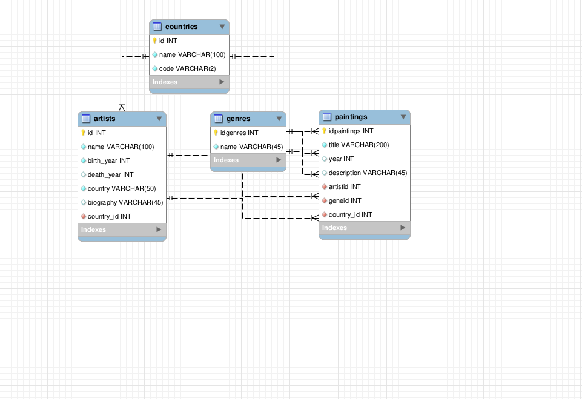

### Сделал

1 переделал модель 
2 инит гит на локальной галерее прошлой практики
3 настроил гит игнор
4 запушил на гит хаб в новый репозиторий
5 установил пхп компосер нгинкс
6 настроил нгинкс с ларавел
7 поменял кучу разных прав
8 настроил базы данных
9 миграции сидеры
10 поставил нужный маршрут
11 и запушил мастер

### Не получилось

### Вопросы

нет
### Пожелания
домашнего уюта